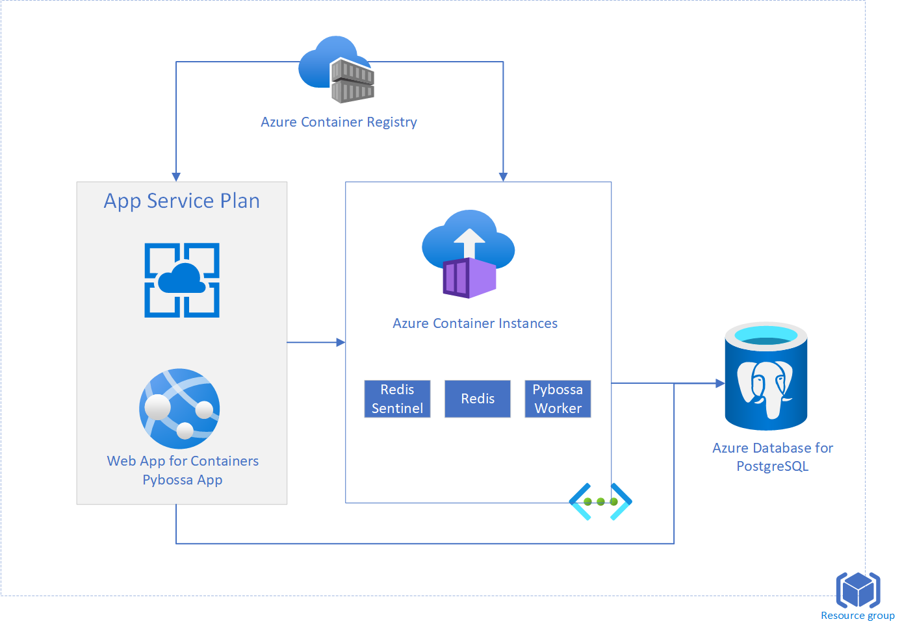

# Deploying Pybossa application in Azure



### prerequisite
- Install [Azure CLI](https://docs.microsoft.com/en-us/cli/azure/install-azure-cli-windows?tabs=azure-cli)
- Install [Docker](https://docs.docker.com/docker-for-windows/install/)


### Create Container Registry
Create a Resource group named *pybossa*
```azurecli
az group create --name pybossa --location eastus
```

Create an [Azure Container Registry](https://docs.microsoft.com/en-us/azure/container-registry/container-registry-get-started-azure-cli) to store the images
```azurecli
az acr create --resource-group pybossa --name <registry-name> --sku Basic
az acr login --name regpybossa
az acr update -n <registry-name> --admin-enabled true
```

Clone the git repository
```bash
git clone https://github.com/seenu433/pybossa-on-azure
```

### Build the docker images and push them to the Image Registry

```bash
# building the redis sentinel image
cd docker-redis-sentinel
dos2unix entrypoint.sh  # run this command if using windows command prompt
docker build -t regpybossa.azurecr.io/redis-sentinel:latest . 
docker push regpybossa.azurecr.io/redis-sentinel:latest

# building the pybossa image
cd ..
cd docker-pybossa
dos2unix entrypoint.sh  # run this command if using windows command prompt
docker build -t regpybossa.azurecr.io/pybossa:latest .
docker build  --build-arg CACHEBUST=<var> -t registry.azurecr.io/pybossa:latest .
docker push regpybossa.azurecr.io/pybossa:latest
cd ..
```

### Create the database

Create an [Azure Database for PostgreSQL](https://docs.microsoft.com/en-us/azure/postgresql/quickstart-create-server-database-portal)
Configure the [firewall rule](https://docs.microsoft.com/en-us/azure/postgresql/quickstart-create-server-database-portal#configure-a-firewall-rule) to allow access to Azure Services and Add current client IP address
Create database with name *pybossa*

Create the schema for the database by running the pybossa db_create package

```bash
docker run --rm -it -e POSTGRES_URL="postgresql://<username>:<password>@<servername>.postgres.database.azure.com/pybossa" <registry-name>.azurecr.io/pybossa:latest python cli.py db_create
```

### Test the app locally
Run the container locally to test. Docker installation required.
```bash
# Install redis from docker hub
docker run -d --name redis-master redis:3.0-alpine

# Install redis-sentinel
docker run -d --name redis-sentinel  --link redis-master  regpybossa.azurecr.io/redis-sentinel

# Install pybossa app
docker run -d --name pybossa --link redis-master --link redis-sentinel -e POSTGRES_URL="postgresql://<username>:<password>@<servername>.postgres.database.azure.com/pybossa" -p 8080:8080  regpybossa.azurecr.io/pybossa:latest
```

Test the app by opening a browser window and navigating to *http://localhost:8080*

### Deploy the backend components to Azure Container Instances

```azurecli
# Create a Virtual Network and a subnet 
az network vnet create --resource-group pybossa --name pybossa-vnet --address-prefix 10.0.0.0/16  --subnet-name backend-snt --subnet-prefix 10.0.0.0/24

# Deploy the redis master container
az container create  --name pybossa-redis-pvt --resource-group pybossa  --image redis:3.0-alpine  --vnet pybossa-vnet  --subnet backend-snt --restart-policy always --ports 6379

# Note the IP of the redis container to be updated in *aci-redis-sentinal-private.yaml* as *<redis-container-ip>*
az container show --resource-group pybossa --name pybossa-redis-pvt --query ipAddress.ip --output tsv

# Note the network profile id to be updated in *aci-redis-sentinal-private.yaml* and *aci-pbworker-private.yaml* as *<network-profile-id>*
az network profile list --resource-group pybossa  --query [0].id --output tsv

# Grab the username and password for the container registry and update *aci-redis-sentinal-private.yaml* and *aci-pbworker-private.yaml* for *<registry-username>*, *<registry-password>* and *<registry-name>*
az acr credential show -n <registry-name>.azurecr.io

# Deploy the Sentinel container
az container create --resource-group pybossa  --file aci-redis-sentinal-private.yaml

# Note the IP of the redis container to be updated in *aci-pbworker-private.yaml* as *<redis-sentinel-ip>*
az container show --resource-group pybossa --name pybossa-redis-sentinel-pvt --query ipAddress.ip --output tsv

# Deploy the worker container
az container create --resource-group pybossa  --file aci-pbworker-private.yaml
```

### Deploy the app to an App Service

```azurecli
# Create an app service plan
az appservice plan create --name pybossa-plan --resource-group pybossa --is-linux --sku P1V2

# Create an app service. Note that the app-name will be part of the url like *https://<app-name>.azurewebsites.net*
az webapp create --resource-group pybossa --plan pybossa-plan --name <app-name> --deployment-container-image-name <registry-name>.azurecr.io/pybossa:latest

# Configure the environment variables
az webapp config appsettings set --resource-group pybossa --name <app-name> --settings POSTGRES_URL="postgresql://<username>:<password>@<servername>.postgres.database.azure.com/pybossa"

az webapp config appsettings set --resource-group pybossa --name <app-name> --settings REDIS_SENTINEL="<redis-sentinel-ip>"

# Create a subnet for the app service vnet integration
az network vnet subnet create -g pybossa --vnet-name pybossa-vnet -n frontend-snt --address-prefixes 10.0.1.0/24

# Integrate the app service to the vnet
az webapp vnet-integration add -g pybossa -n <app-name> --vnet pybossa-vnet --subnet frontend-snt

```

Launch the application by navigating to *https://{app-name}.azurewebsites.net* 


